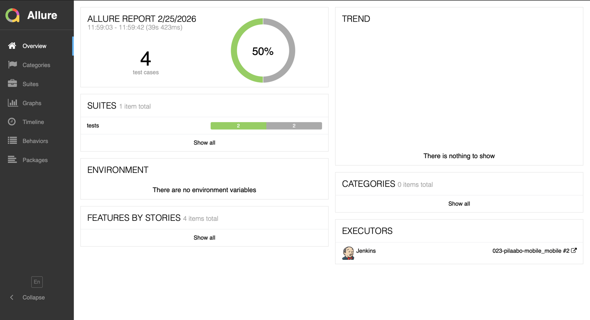
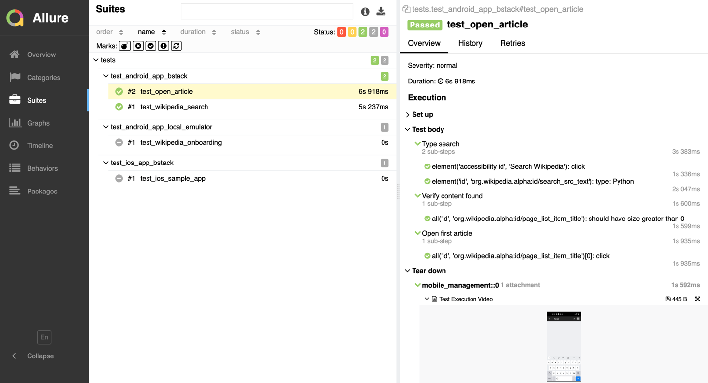
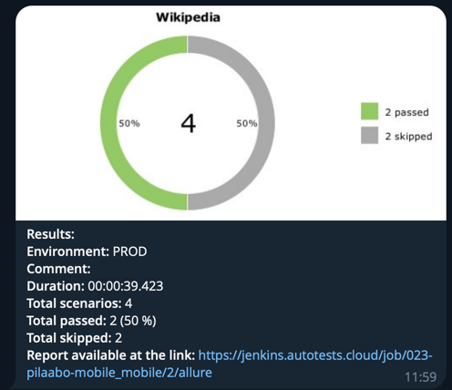

# Wikipedia Mobile Автотесты

<p align="center">
  
</p>

## 📑 Содержание

- [Технологии и инструменты](#-технологии-и-инструменты)
- [Покрытый функционал](#-покрытый-функционал)
- [Структура проекта](#-структура-проекта)
- [Запуск тестов](#-запуск-тестов)
- [Сборка в Jenkins](#-сборка-в-jenkins)
- [Allure отчёт](#-allure-отчёт)
- [Уведомление в Telegram](#-уведомление-в-telegram)

---

## 💻 Технологии и инструменты

<p align="center">
  <a href="https://www.python.org/"></a>
  <a href="https://docs.pytest.org/"></a>
  <a href="https://appium.io/"></a>
  <a href="https://yashaka.github.io/selene/"></a>
  <a href="https://www.browserstack.com/"></a>
  <a href="https://allurereport.org/"></a>
  <a href="https://www.jenkins.io/"></a>
  <a href="https://telegram.org/"></a>
</p>

| Инструмент                                                   | Описание                                                   |
|--------------------------------------------------------------|------------------------------------------------------------|
| [Python](https://www.python.org/)                            | Язык программирования                                      |
| [Pytest](https://docs.pytest.org/)                           | Фреймворк для запуска тестов                               |
| [Appium](https://appium.io/)                                 | Фреймворк для мобильной автоматизации                      |
| [Selene](https://yashaka.github.io/selene/)                  | Обёртка над Selenium/Appium с лаконичным API               |
| [BrowserStack](https://www.browserstack.com/)                | Облачная платформа для запуска тестов на реальных устройствах |
| [Pydantic](https://docs.pydantic.dev/)                       | Валидация и управление конфигурацией                       |
| [Allure Report](https://allurereport.org/)                   | Генерация наглядных отчётов                                |
| [Jenkins](https://www.jenkins.io/)                           | CI/CD сервер для запуска тестов                            |
| [Telegram Bot](https://core.telegram.org/bots)               | Уведомления о результатах прогона                          |

---

## ✅ Покрытый функционал

Автотесты покрывают мобильное приложение **Wikipedia** (Android & iOS):

### 📱 Android — BrowserStack — `test_android_app_bstack.py` (2 теста)

- ✅ Поиск статьи по запросу «Appium» — проверка результатов поиска
- ✅ Открытие статьи по запросу «Python» — переход в найденную статью

### 🏠 Android — Локальный эмулятор — `test_android_app_local_emulator.py` (1 тест)

- ✅ Прохождение онбординга (4 экрана) — проверка текстов и навигации

### 🍏 iOS — BrowserStack — `test_ios_app_bstack.py` (1 тест)

- ✅ Ввод текста и проверка вывода в Sample App

### 🔍 Каждый тест включает

- Детализированные **шаги** через `allure.step()`
- Логирование действий **Selene** в Allure через `wait_with()`
- Прикрепление **видео** из BrowserStack к отчёту (для облачных тестов)
- Автоматическую настройку драйвера через **фикстуры**

---

## 📂 Структура проекта

```
mobile_tests/
├── conftest.py                         # Корневая конфигурация (если есть)
├── pytest.ini                          # Конфигурация Pytest (alluredir)
├── requirements.txt                    # Зависимости проекта
├── .env.example                        # Шаблон конфигурации окружений
├── .env.bstack                         # Настройки для BrowserStack
├── .env.local_emulator                 # Настройки для локального эмулятора
├── .env.credentials                    # Логины и ключи (не в Git)
├── .gitignore                          # Исключения для Git
│
├── src/                                # Исходный код
│   └── utils/
│       ├── config.py                   # Конфигурация: контексты, Pydantic Settings
│       └── allure.py                   # Утилита: прикрепление видео из BrowserStack
│
├── tests/                              # Тестовые модули
│   ├── conftest.py                     # Фикстуры: Appium-драйвер, Selene, teardown
│   ├── test_android_app_bstack.py      # Android-тесты в BrowserStack (2 теста)
│   ├── test_android_app_local_emulator.py  # Android-тесты на эмуляторе (1 тест)
│   └── test_ios_app_bstack.py          # iOS-тесты в BrowserStack (1 тест)
│
├── resources/
│   └── apks/
│       └── wikipedia.apk               # APK приложения Wikipedia
│
└── notifications/
    ├── allure-notifications-4.11.0.jar  # Утилита для отправки отчётов
    └── telegram.json.example            # Шаблон конфигурации Telegram-бота
```

---

## 🚀 Запуск тестов

### Переменные окружения

Проект использует систему **контекстов**. Переменная `CONTEXT` определяет, какой `.env`-файл загружается:

| Контекст         | Файл                 | Описание                            |
|------------------|----------------------|-------------------------------------|
| `bstack`         | `.env.bstack`        | Облачный запуск в BrowserStack      |
| `local_emulator` | `.env.local_emulator`| Локальный Android-эмулятор          |

> Скопируйте `.env.example` и создайте нужные файлы. Для BrowserStack также создайте `.env.credentials`.

### Локальный запуск

```bash
# Установка зависимостей
pip install -r requirements.txt

# Запуск тестов на BrowserStack (по умолчанию)
pytest

# Запуск тестов на локальном эмуляторе
CONTEXT=local_emulator pytest tests/test_android_app_local_emulator.py

# Запуск Android-тестов в BrowserStack
CONTEXT=bstack pytest tests/test_android_app_bstack.py

# Запуск iOS-тестов в BrowserStack
CONTEXT=bstack pytest tests/test_ios_app_bstack.py

# Генерация Allure отчёта
allure serve allure-results
```

---

##  Сборка в Jenkins

> Ссылка на Job: [Jenkins Job](https://jenkins.autotests.cloud/job/023-pilaabo-thesis_mobile)

<!-- Раскомментировать и добавить скриншот: -->
<!--  -->

---

##  Allure отчёт

> Ссылка на Allure Report: [Allure Report](https://jenkins.autotests.cloud/job/023-pilaabo-thesis_mobile/allure)




### Отчёт содержит

- **Шаги (Steps)** — каждый `allure.step()` + автоматические шаги Selene
- **Вложения** — видео выполнения теста из BrowserStack
- **Окружение** — платформа, устройство, версия ОС

---

##  Уведомление в Telegram



После прохождения тестов бот отправляет уведомление в Telegram-чат с результатами прогона.
